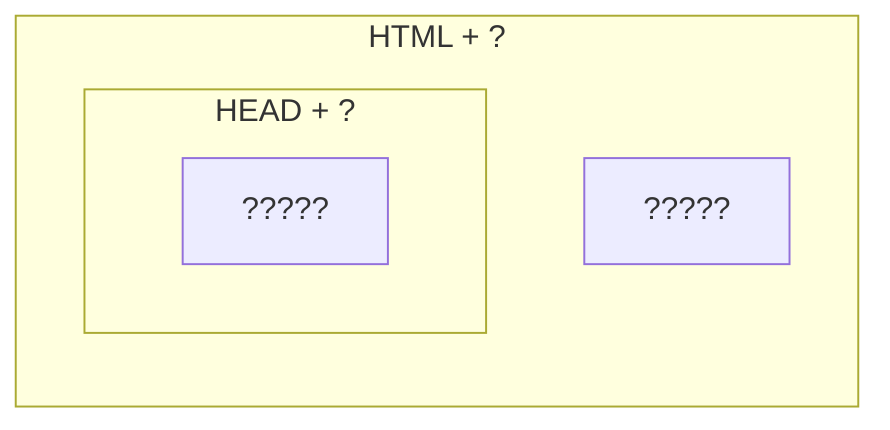

# Astro Plain

Generic, batteries-included template
for building pages with [Astro](https://astro.build).

**Astro Plain** provides
a convinient way of controlling
the surrounding HTML of a page
as well as it's HEAD,
including (but not limited to)
title, styles and scripts.



## Usage

```bash
npm i astro-plain
```

```astro
---
import Root from "astro-plain";
---
<Root {...Astro.props}>
  <main>
    <header> ... </header>
    ...
    <footer> ... </footer>
  </main>
</Root>
```

## Special Features

This template includes special features
to make common tasks easier.

### Blank Favicon

By default, this template uses
an embedded blank icon.
This prevents the page from
making failed calls to favicon.ico
upon load.

### Titles Array

You may pass an array to the "title" property.
Items will be joined with the value of "titleJoiner".
This is useful for creating titles represented nested pages.

### Meta Tags + Open Graph

You may pass a nested object to the
meta property and keys will be joined using ":".
This is useful for creating meta tags that follow the Open Graph schema.

```astro
<Root
  meta={{
    og:{
      image: "abc.png",
    },
  }}
></Root>
```

produces

```html
...
<meta name="og:image" content="abc.png" />
...
```

set the "ogMeta" or "twitterMeta" properties to true and appropriate Open Graph meta tags will be generated from the provided title, image, and description.

### SEO

This template takes titles, description and keywords as props and produces and produces the appropraite metatags for SEO.

```astro
<Root = titles={["Example Web Page", "Part 2" ]} titleJoiner=": "
description="Second of an example web pages."
keywords={["example", "test", "astro", "page"]}
 ></Root>
```

```html
<meta name="title" content="Example Web Page: Part 2" />
<meta name="description" content="Second of an example web pages" />
<meta name="keywords " content="example, test, astro, page" />
```

### Google Tag Manager

You may pass in a tag manager ID
to add Google Tag Manager to your site.

Important!
Tag Manager requires that additional HTML
be added to the body of your site.
Astro astro-plain's GenericPage component
specifically avoids affecting
content of the body tag.
Import the TagManagerBody
component into the body of your applicaiton.

```astro
---
import Root, {TagManagerBody} from "astro-plain";
const TagManagerID = "GTM-XXXXX";
---
<Root tmid={TagManagerID}>
    ...
    <TagManagerBody tmid={TagManagerID} slot="append-to-body"/>
</Root>
```

## API

### Slots

Slot exist to pass components into other components

#### Default

By default,
tags passed to the element
appear withing the body tag.

#### slot="append-to-head"

Tags passed with the "slot" attribute set to "append-to-head" are appeneded to the HEAD tag.

#### slot="append-to-body"

Tags passed with the "slot" attribute set to "append-to-body" are appended to BODY tag.

### Props

Aside from passing in other components,
this component is configured to accept a number of props:

#### title

#### titleJoiner

#### charSet

#### description

#### keywords

#### author

#### canonical

#### htmlClass

#### serviceWorkerScript

#### favicon

#### faviconType

#### tmid

#### manifest

#### criticalStyles

#### criticalScripts

#### externalStyles

#### externalScripts

#### appleTouchIcons

#### webComponents

#### meta

#### lang
