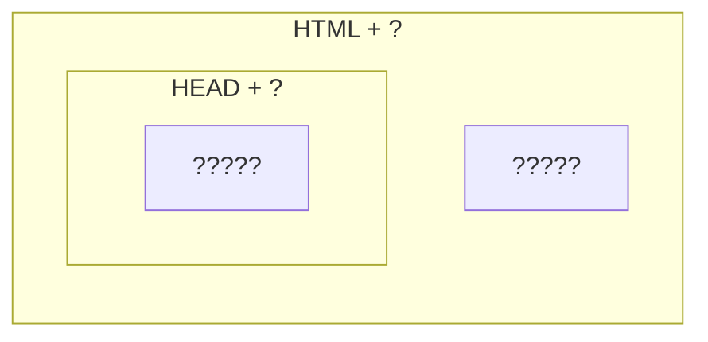

# Astro Plain

Generic, batteries-included template
for building pages with [Astro](https://astro.build).

**Astro Plain** provides
a convinient way of controlling
the surrounding HTML of a page
as well as it's HEAD,
including (but not limited to)
title, styles and scripts.



## Usage

```bash
npm i astro-plain
```

```astro
---
import GenericPage from "astro-plain";
const props = {};
---
<GenericPage {...props}>
<body>
<!-- content --!>
</body>
</GenericPage>
```

## Special Features

This template includes special features
to make common tasks easier.

### Blank Favicon

By default, this template uses
an embedded blank icon.
This prevents the page from
making failed calls to favicon.ico
upon load.

### Titles Array

You may pass an array to the "title" property.
Items will be joined with the value of "titleJoiner".
This is useful for creating titles represented nested pages.

### Meta Tags + Open Graph

You may pass a nested object to the
meta property and keys will be joined using ":".
This is useful for creating meta tags that follow the Open Graph schema.

```astro
<GenericPage
  meta={{
    og:{
      image: "abc.png",
    },
  }}
></Generic>
```

produces

```html
...
<meta name="og:image" content="abc.png" />
...
```

### SEO

This template takes titles, description and keywords as props and produces and produces the appropraite metatags for SEO.

```astro
<GenericPage = titles={["Example Web Page", "Part 2" ]} titleJoiner=": "
description="Second of an example web pages."
keywords={["example", "test", "astro", "page"]}
 >
```

```html
<meta name="title" content="Example Web Page: Part 2" />
<meta name="description" content="Second of an example web pages" />
<meta name="keywords " content="example, test, astro, page"" />
```

### Google Tag Manager

You may pass in a tag manager ID
to add Google Tag Manager to your site.

Important!
Tag Manager requires that additional HTML
be added to the body of your site.
Astro astro-plain's GenericPage component
specifically avoids affecting
content of the body tag.
Import the TagManagerBody
component into the body of your applicaiton.

```astro
---
import GenericPage, {TagManagerBody} from "astro-plain";
const TagManagerID = "GTM-XXXXX";
---
<GenericPage tmid={TagManagerID}>
  <body>
    ...
    <TagManagerBody tmid={TagManagerID} />
  </body>
</GenericPage>
```

## API

### Slots

Slot exist to pass components into other components

#### Default

By default,
tags passed to the element
appear immediately after
the head tag.

This _should_ be a single BODY tag.

#### slot="head"

Tags passed with the "slot" attribute set to "head" are inserted after the HEAD tag.

### Props

Aside from passing in other components,
this component is configured

#### title

#### titleJoiner

#### charSet

#### description

#### keywords

#### author

#### canonical

#### htmlClass

#### serviceWorkerScript

#### favicon

#### faviconType

#### tmid

#### manifest

#### criticalStyles

#### criticalScripts

#### externalStyles

#### externalScripts

#### appleTouchIcons

#### webComponents

#### meta

#### lang
